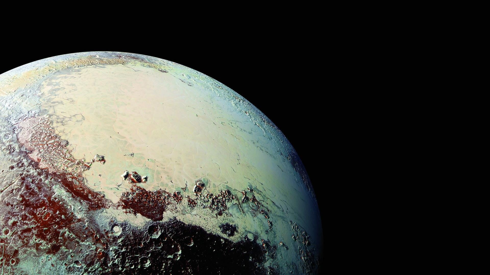

## Pluto

Pluto is a dwarf planet in the Kuiper belt, a ring of bodies beyond the orbit of Neptune. 

It was the first and the largest Kuiper belt object to be discovered. 

After Pluto was discovered in 1930, it was declared to be the ninth planet from the Sun.

The New Horizons spacecraft performed a flyby of Pluto on July 14, 2015, becoming the first and, to date, only spacecraft to do so.

During its brief flyby, New Horizons made detailed measurements and observations of Pluto and its moons. 

In September 2016, astronomers announced that the reddish-brown cap of the north pole of Charon is composed of tholins, 
organic macromolecules that may be ingredients for the emergence of life, and produced from methane, 
nitrogen and other gases released from the atmosphere of Pluto and transferred 19,000 km (12,000 mi) to the orbiting moon.

Pluto's diameter is 2376.6±3.2 km and its mass is (1.303±0.003)×1022 kg, 17.7% that of the Moon (0.22% that of Earth).
Its surface area is 1.779×107 km2, or roughly the same surface area as Russia. 
Its surface gravity is 0.063 g (compared to 1 g for Earth and 0.17 g for the Moon).

The Pluto Files: The Rise and Fall of America's Favorite Planet is a book written by the astrophysicist and Hayden Planetarium director Neil deGrasse Tyson. 

The book is about Pluto, which was demoted to the status of dwarf planet in August 2006 by the International Astronomical Union, thereby depriving it of its planet-hood.

The book also focuses on the fact that many Americans rallied their support for this icy dwarf on the edge of the Solar System because it was discovered by an American.

The book was given a good review by Jon Stewart in a guest segment with Tyson on The Daily Show. During the interview, Stewart humorously lauded the book as "the most exciting book about Pluto you will ever read in your life," as well as "the compelling story of how [Tyson] destroyed Pluto's life."[3]

The book explains in full detail the journey of Pluto's life from its days as Planet X, to its discovery in the early 20th century and all the way to its current title as a Trans-Neptunian object.

The book appeared on the extended hardcover nonfiction bestseller list in The New York Times in February 2009.
